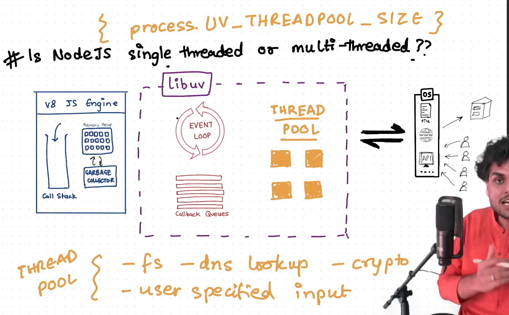
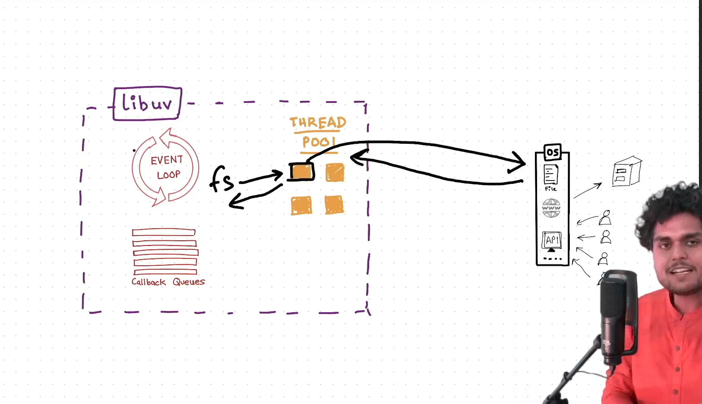
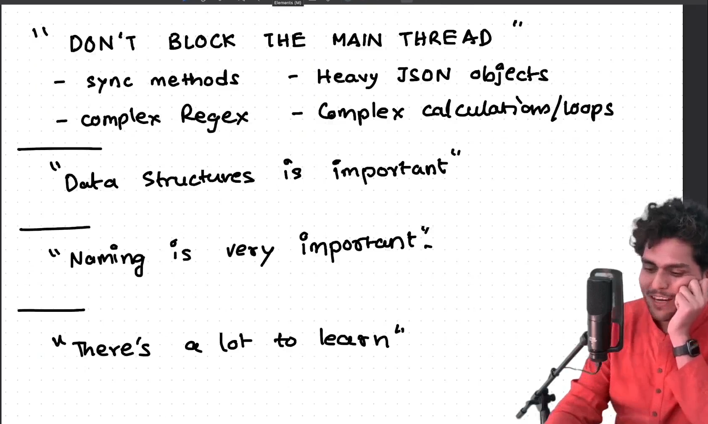

# Episode 10: Thread pool in libuv

## Is NodeJS single threaded or multi threaded?
- v8 engine offloads the task to libuv, now libuv uses a thread in the thread pool to complete the task.
- in Node.js the size of the thread pool is 4 by default (`UV_THREADPOOL_SIZE`)

### What will happen if I make 5 file reading calls simultaneously?
- The first 4 file read operations will execute in parallel.
- Once any of these threads completes its task, the 5th operation will start.

### To answer the question 
- Node.js is always single-threaded in terms of JavaScript execution and the event loop.
- However, for certain asynchronous operations (like I/O or heavy computations), 
- Node.js may offload tasks to a background **thread pool** or the operating system, allowing it to perform **non-blocking** operations. 
- However, JavaScript itself still runs on a single thread.

### Dont do this on main thread

- sync methods
- heavy json objects 
- complex regex
- complex calculations / loops 

"Data structures is important"
>Data structure used in behind the scene in libuv to manage the `setTimeout`, epoll etc is min heap.  

"Naming variable is very important."
- `process.nextTick()` should execute in the next tick but happens immediately
- `setImmediate()` should happen immediate but execute in the next tick

- one cycle of event loop is known as `tick`.
---
Read about: epoll ( what ds epoll uses?), fds, socket descriptors, event emitters, stream, buffer, pipes, process.nextTick