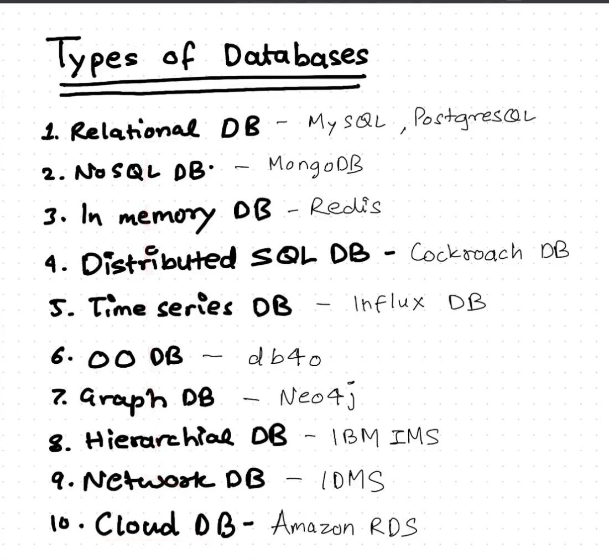
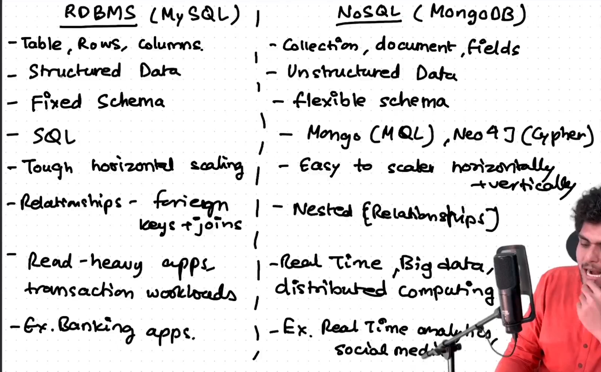

### Database:

- It is an **organized** collection of data.
- type of data store based on the use of a Database Management System
    - software which interacts with end users, applications, and the database itself to capture and analyse the data

### RDBMS (MySQL, PostgreSQL)

- EF Codd - Codd’s 12 rules (0 - 12)
    - If your Database follows these 12 rules, then your DB becomes Relational DB.
- Michael Widenius created MySQL,
    - He also created MarioDB and MaxDB
    - MySQL forks MarioDB
- Sun MicroSystems acquired MySQL, and ORACLE now acquires Sun Micro System.

- PostgreSQL was created by Michael
    - Ingres → PostIngres → PostgreSQL (Name evolve)

- SQL ⇒ Structured Query Language

### NoSQL ( MongoDB)

- Document DB, Key value DB, Graph DB, wide column DB, Multi Model DB
- NoSQL created in 1998
- MongoDB was created in 2009 and coincidentally nodejs was also developed in same year
    - Created by 10gen
    - Developer Friendly
    - Compatible with JS stack
    - Stores data in JSON

## RDBMS  vs NoSQL

### RDBMS (MySQL)

- Table, Rows and Columns
- Structured Data
- Fixed Schema
- SQL (Structured Query Language)
- Tough to horizontal scaling
- Relationships ⇒ Foreign keys + joints
- good for read-heavy apps transaction workloads
- Ex: Banking Apps

### NoSQL (MongoDB)
- Collection, Documents and Fields
- Unstructured Data
- Flexible Schema
- Mongo (MQL), Neo4j (Cypher), language depends type of DB
- Easy to Scale horizontally + vertically
- Nested Relationships
- Real-time, big data, **distributed computing**
- Ex: Real-time analytics, social media

Read About Uber’s Schemaless Database using MySQL https://www.uber.com/en-IN/blog/schemaless-part-one-mysql-datastore/

---

### Database

- **Organized** collection of data.
- Uses **DBMS** (Database Management System) for interaction between users, applications, and data.

### RDBMS (MySQL, PostgreSQL)

- **EF Codd's 12 rules** → defines a relational database.
- **MySQL** created by Michael Widenius.
    - Forks: **MariaDB** (from MySQL), **MaxDB**.
    - **Sun Microsystems** acquired MySQL, then Oracle acquired Sun Microsystems.
- **PostgreSQL** created by Michael Stonebraker.
    - Evolution: **Ingres** → **Postgres** → **PostgreSQL**.
- Uses **SQL** (Structured Query Language).

### NoSQL (MongoDB)

- Types: Document DB, Key-Value DB, Graph DB, Wide Column DB, Multi-Model DB.
- **MongoDB** created by 10gen (2009).
    - Stores data in **JSON** format, developer-friendly, works well with JS stack.

### RDBMS vs NoSQL

- **RDBMS (e.g., MySQL, PostgreSQL)**
    - Structured data: **Tables, Rows, Columns**.
    - **Fixed Schema**.
    - Uses **SQL**.
    - Harder to scale horizontally.
    - Best for read-heavy apps, transactional workloads (e.g., Banking).
- **NoSQL (e.g., MongoDB)**
    - Unstructured data: **Collections, Documents, Fields**.
    - **Flexible Schema**.
    - Easier to scale horizontally and vertically.
    - Real-time data, Big Data, distributed computing.
    - Best for real-time analytics, social media apps.

### Types of Databases

1. **Relational DB (RDBMS)**: MySQL, PostgreSQL.
2. **NoSQL DB**: MongoDB.
3. **In-memory DB**: Redis.
4. **Distributed SQL DB**: CockroachDB.
5. **Time Series DB**: InfluxDB.
6. **Object-Oriented DB**: db4o.
7. **Graph DB**: Neo4j.
8. **Hierarchical DB**: IBM IMS.
9. **Network DB**: IDMS.
10. **Cloud DB**: Amazon RDS.

### Key Differences

- **Structure**:
    - RDBMS: Table-based (Rows & Columns).
    - NoSQL: Collection of documents, flexible schema.
- **Schema**:
    - RDBMS: Fixed Schema, predefined.
    - NoSQL: Schema-less, dynamic.
- **Relationships**:
    - RDBMS: Foreign keys, joins.
    - NoSQL: Embedded documents, references.
- **Scaling**:
    - RDBMS: Difficult to scale horizontally.
    - NoSQL: Easily scalable both horizontally and vertically.
- **Use Case**:
    - RDBMS: Transactions, strong consistency (e.g., Banking).
    - NoSQL: Real-time data, flexibility (e.g., Social media, real-time analytics).

### Notable Examples

- **RDBMS**: Banking apps, transaction-heavy systems.
- **NoSQL**: Real-time analytics, content management systems.