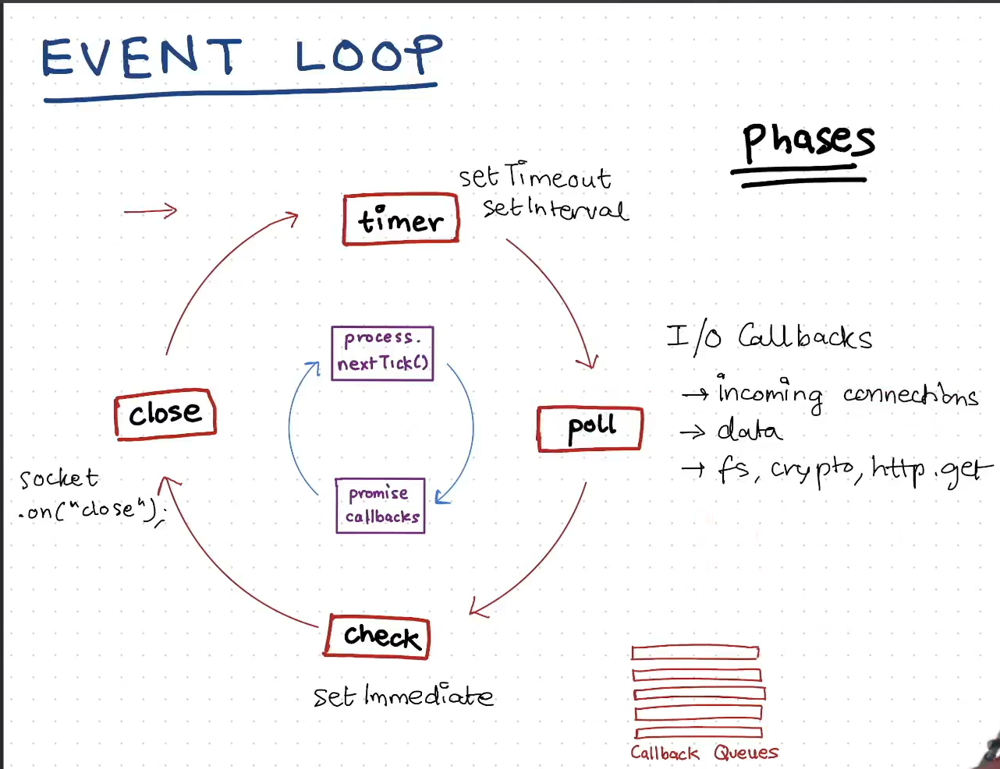

# Episode 09: libuv & Event Loop

## The Event Loop in LIBUV Operates in Four Major Phases:
1. Timer
2. Poll
3. Check
4. Close

1. Timer Phase
- All the callbacks that were set using `setTimeout` and `setInterval` are executed in this phase.
>Note: These callbacks are executed once their timer has expired, but execution order is not guaranteed if two timers are set with the same delay.
>
2. Poll Phase
- Handles I/O callbacks.
- Functions like `fs.readFile()`, `https.get()`, and other callbacks are executed here.
- This phase also handles incoming connections and data.
3. Check Phase
- The `setImmediate()` callbacks are executed in this phase.
4. Close Phase
- Any callbacks associated with closing operations, such as socket closures, are handled here.
- This phase is typically used for cleanup tasks, ensuring that resources are properly released.


### Microtasks: process.nextTick() and Promise Callbacks
- Before the event loop moves to the next phase, it first processes any pending microtasks.

- `process.nextTick()`: Allows you to add a task that will be executed before the event loop proceeds to the next phase, effectively prioritizing certain tasks.
- Promise callbacks: These are added to the microtask queue and processed after the current phase of the event loop but before moving to the next one.
>Note: Microtasks can keep running until the queue is empty, so it is possible to starve the event loop by continuously adding new microtasks with `process.nextTick()` or Promises.
>





# Code Examples and Output 

## Example 1 Basic Asynchronous Operations
```

const fs = require("fs");

const a =100; // 1
setImmediate(()=>{ console.log("Immediate 1")} ); // 2

fs.readFile("file.txt","utf8",(err,data)=>{  // 3
    console.log("File Data: ",data); 
}  );

setTimeout(()=>{ // 4
    console.log("Timeout 1")
} ,0); 

function printA(){  // 5
    console.log("A = ",a); 
}

printA(); // 6 

console.log("Last Line of the code"); // 7
```
OUPUT:
```
A = 100
Last Line of the code
Timeout 1
Immediate 1
File Data: Text inside the file
```

### Explanation 
1. V8 Initialization:
- Variable `a` is initialized with the value `100` and stored in memory.
2. Offloading to libuv:
- `setImmediate()` and `fs.readFile()` are offloaded to the event loop for later execution.
- `setTimeout()` is also offloaded with a 0ms delay.
3. Synchronous Execution:
- The function `printA()` is immediately invoked, logging A = 100.
- "Last Line of the code" is logged next.
4. Event Loop Phases:
- Timers Phase: The `setTimeout()` callback is executed.
- Check Phase: The `setImmediate()` callback is executed.
- I/O Completion: After the file I/O completes, the `fs.readFile()` callback is executed.

## Example 2 Priority of `Promises` and `process.nextTick()`
```
const a = 100; // 1

setImmediate(() => console.log("setImmediate")); // 2

Promise.resolve().then(() => console.log("Promise")); // 3

fs.readFile("./file.txt", "utf8", () => { // 4
    console.log("File Reading CB");
});

setTimeout(() => console.log("Timer expired"), 0); // 5

process.nextTick(() => console.log("process.nextTick")); // 6

function printA() { // 7
    console.log("a =", a);
}

printA(); // 8
console.log("Last line of the file."); // 9
```
OUTPUT: 
```
a = 100
Last line of the file
process.nextTick
Promise
Timer expired
setImmediate
File Reading CB
```
### Explanation:

- `process.nextTick()` executes before Promises and other asynchronous callbacks.
- Promises are executed after `process.nextTick()` but before timers (setTimeout).


> Event loop waits at the poll phase, when no more events are there to execute
>
## Example 3 Asynchronous Flow with Nested Callbacks
```setImmediate(() => console.log("setImmediate")); // 1

setTimeout(() => console.log("Timer expired"), 0); // 2

Promise.resolve().then(() => console.log("Promise")); // 3

fs.readFile("./file.txt", "utf8", () => { // 4
    setTimeout(() => console.log("2nd timer"), 0); // 4.1
    process.nextTick(() => console.log("2nd nextTick")); // 4.2
    setImmediate(() => console.log("2nd setImmediate")); // 4.3
    console.log("File Reading CB"); // 4.4
});

process.nextTick(() => console.log("nextTick")); // 5

console.log("Last line of the file."); // 6
```
OUTPUT: 
```
Last line of the file
nextTick
Promise
Timer expired
setImmediate
File Reading CB
2nd nextTick
2nd setImmediate
2nd timer
```
### Explanation:

- `process.nextTick()` always runs first before any other asynchronous operations.
- Even nested callbacks maintain the priority of `process.nextTick()` over other events

## Example 4 `process.nextTick()` Priority and Nesting
```const fs = require("fs");

setImmediate(() => console.log("setImmediate")); // 1

setTimeout(() => console.log("Timer expired"), 0); // 2

Promise.resolve("Promise").then(console.log); // 3

fs.readFile("./file.txt", "utf8", () => { // 4
  console.log("File Reading CB");
});

process.nextTick(() => {   // 5
  process.nextTick(() => console.log("inner nextTick")); // 5.1
  console.log("nextTick"); // 5.2
});

console.log("Last line of the file."); // 6
```
OUPTUP: 
```Last line of the file
nextTick
inner nextTick
Promise
Timer expired
setImmediate
File Reading CB
```
### Explanation:

- `process.nextTick()` takes priority over all other asynchronous operations, including `Promise` and timers.
- When nested, the innermost `process.nextTick()` callback executes before the outer ones

 >`process.nextTick` callbacks have a higher priority than other asynchronous
operations. This means that if you have nested process.nextTick callbacks, the
inner process.nextTick callback will be executed before the outer one.
 >

## in short 
- Execution Priority: `process.nextTick()` > Promises > Timers (setTimeout) > `setImmediate()` > I/O callbacks
- Avoid starving the event loop with too many microtasks (e.g., `process.nextTick()`).