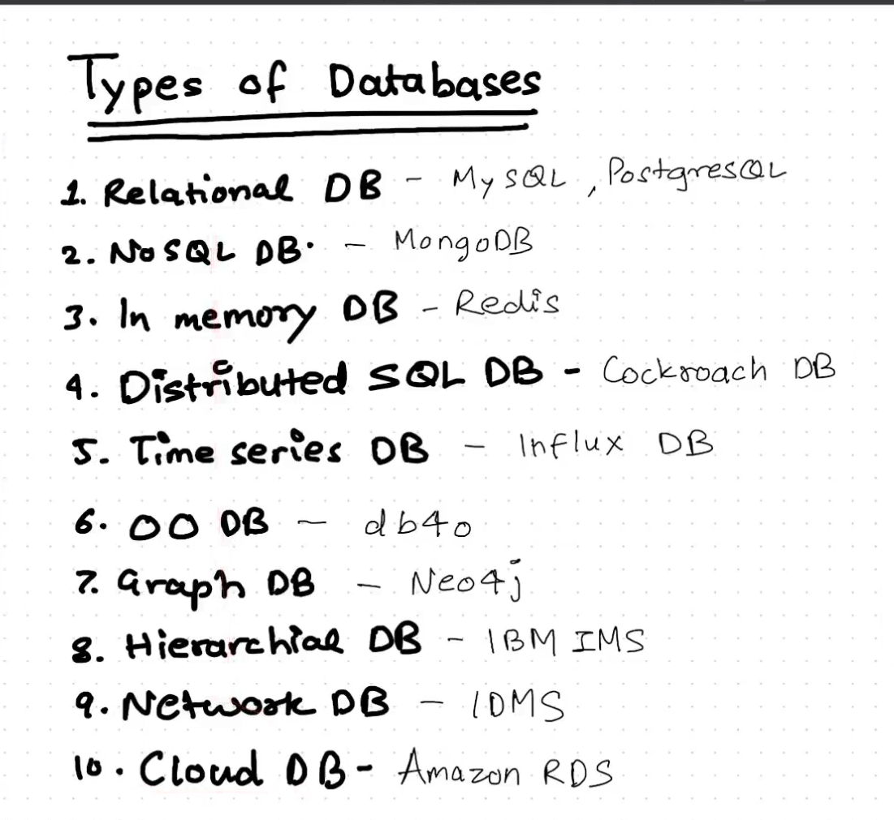
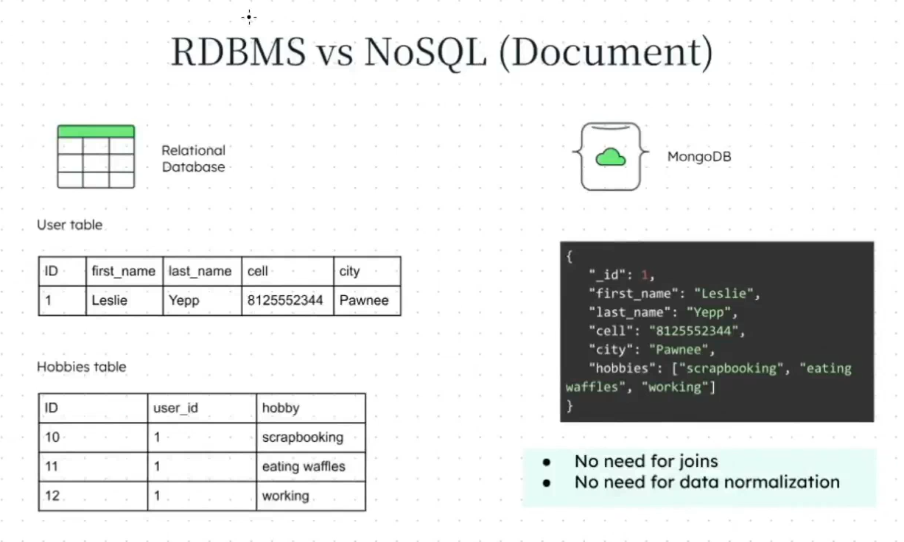
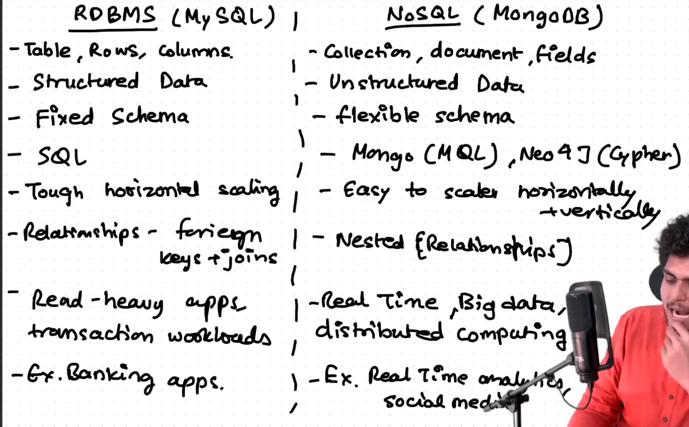

# Episode 12: Databses SQL and NoSQL

### Database

- **Organized** collection of data.
- Uses **DBMS** (Database Management System) for interaction between users, applications, and data.

### Types of Databases

1. **Relational DB (RDBMS)**: MySQL, PostgreSQL.
2. **NoSQL DB**: MongoDB.
3. **In-memory DB**: Redis. (Caching, session management.)
4. **Distributed SQL DB**: CockroachDB. (Global apps, multi-region apps.)
5. **Time Series DB**: InfluxDB. (IoT, monitoring systems.)
6. **Object-Oriented DB**: db4o. (Complex data structures, object-oriented programming.)
7. **Graph DB**: Neo4j. (Social media, fraud detection.)
8. **Hierarchical DB**: IBM IMS. (Legacy systems, mainframes.)
9. **Network DB**: IDMS. (Large-scale applications, complex queries.)
10. **Cloud DB**: Amazon RDS. ( Scalable applications, cloud-native apps.)

### RDBMS (MySQL, PostgreSQL)

- **EF Codd's 12 rules** → defines a relational database.
- **MySQL** created by Michael Widenius.
    - Forks: **MariaDB** (from MySQL), **MaxDB**.
    - **Sun Microsystems** acquired MySQL, then Oracle acquired Sun Microsystems.
- **PostgreSQL** created by Michael Stonebraker.
    - Evolution: **Ingres** → **Postgres** → **PostgreSQL**.
- Uses **SQL** (Structured Query Language).

### NoSQL (MongoDB)

- Types: Document DB, Key-Value DB, Graph DB, Wide Column DB, Multi-Model DB.
- **MongoDB** created by 10gen (2009).
    - Stores data in **JSON** format, developer-friendly, works well with JS stack.

### RDBMS vs NoSQL

- **RDBMS (e.g., MySQL, PostgreSQL)**
    - Structured data: **Tables, Rows, Columns**.
    - **Fixed Schema**.
    - Uses **SQL**.
    - Harder to scale horizontally.
    - Best for read-heavy apps, transactional workloads (e.g., Banking).
- **NoSQL (e.g., MongoDB)**
    - Unstructured data: **Collections, Documents, Fields**.
    - **Flexible Schema**.
    - Easier to scale horizontally and vertically.
    - Real-time data, Big Data, distributed computing.
    - Best for real-time analytics, social media apps.

### Key Differences

- **Structure**:
    - RDBMS: Table-based (Rows & Columns).
    - NoSQL: Collection of documents, flexible schema.
- **Schema**:
    - RDBMS: Fixed Schema, predefined.
    - NoSQL: Schema-less, dynamic.
- **Relationships**:
    - RDBMS: Foreign keys, joins.
    - NoSQL: Embedded documents, references.
- **Scaling**:
    - RDBMS: Difficult to scale horizontally.
    - NoSQL: Easily scalable both horizontally and vertically.
- **Use Case**:
    - RDBMS: Transactions, strong consistency (e.g., Banking).
    - NoSQL: Real-time data, flexibility (e.g., Social media, real-time analytics).

### Notable Examples

- **RDBMS**: Banking apps, transaction-heavy systems.
- **NoSQL**: Real-time analytics, content management systems.

Read About Uber’s Schemaless Database using MySQL https://www.uber.com/en-IN/blog/schemaless-part-one-mysql-datastore/

--- 

### DBMS Components

1. **DDL (Data Definition Language)**: Define and manage database structure.
    - **CREATE**: Create database, tables, indexes.
    - **ALTER**: Modify database structure.
    - **DROP**: Delete objects.
    - **TRUNCATE**: Remove all records.
    - **COMMENT**: Add comments.
2. **DML (Data Manipulation Language)**: Manipulate data.
    - **INSERT**: Insert data.
    - **UPDATE**: Modify data.
    - **DELETE**: Delete data.
    - **SELECT**: Query data.
3. **DCL (Data Control Language)**: Control access to data.
    - **GRANT**: Give access.
    - **REVOKE**: Take back access.
4. **TCL (Transaction Control Language)**: Manage transactions.
    - **COMMIT**: Save changes.
    - **ROLLBACK**: Undo changes.

### SQL

- **Structured Query Language**.
- **Types**:
    - **DDL**: Create, Alter, Drop, Truncate.
    - **DML**: Insert, Update, Delete, Select.
    - **DCL**: Grant, Revoke.
    - **TCL**: Commit, Rollback.
- **Operators**: Logical, Comparison, Arithmetic.
- **Functions**: Aggregate, String, Date, Math.
- **Constraints**: Primary Key, Foreign Key, Unique, Not Null.
- **Joins**: Inner Join, Outer Join, Self Join.
- **Indexes**: Clustered, Non-Clustered.
- **Views**: Virtual tables, complex queries.
- **Transactions**: ACID properties, Consistency, Isolation, Durability.
- **Normalization**: Reduce redundancy, improve data integrity.
- **Stored Procedures**: Precompiled SQL queries.
- **Triggers**: Automatically executed SQL code.
- **Cursors**: Iterate over a result set.
- **Transactions**: Group of SQL queries executed

--- 
### MySQL

- **Open-source** RDBMS.
- **Client-Server** model.
- **ACID** properties.
- **SQL**.
- **Storage Engines**: InnoDB (default), MyISAM.
- **Replication**: Master-Slave, Master-Master.
- **Partitioning**: Vertical, Horizontal.
- **Sharding**: Splitting data across multiple servers.
- **Performance Tuning**: Indexing, Query Optimization.
- **Security**: User management, SSL.
- **Backup and Recovery**: mysqldump, binary logs.

### PostgreSQL

- **Open-source** RDBMS.
- **ACID** properties.
- **SQL**.
- **Extensible**: Supports user-defined functions, data types.
- **Replication**: Master-Slave, Master-Master.
- **Partitioning**: Range, List, Hash.
- **Security**: User management, SSL.
- **Performance Tuning**: Indexing, Query Optimization.
- **Backup and Recovery**: pg_dump, WAL.

### MongoDB

- **Open-source** NoSQL DB.
- **Document-oriented**.
- **JSON**-like format.
- **BSON** (Binary JSON) format.
- **Schema-less**.
- **Replication**: Master-Slave, Master-Master.
- **Sharding**: Horizontal scaling.
- **Indexing**: Single-field, Compound, Multi-key.
- **Aggregation Framework**: Pipeline for data aggregation.
- **Security**: User management, SSL.
- **Backup and Recovery**: mongodump, oplog.
