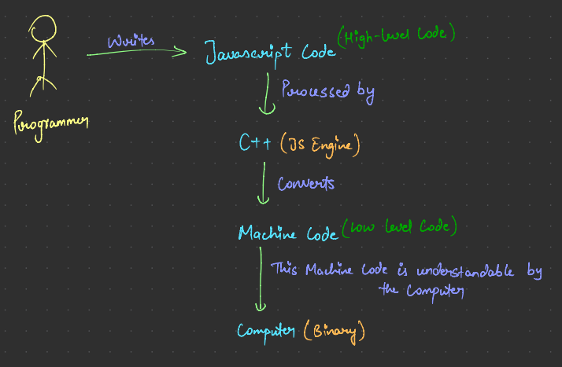

# Lecture 2 Notes
### What is a Server?
- A server is a remote computer/CPU that handles requests.
- Initially, JavaScript was only for browsers, but Node.js allows us to run JavaScript on servers.
- This enables full-stack application development.

### Node.js and V8 Engine
- Node.js is built in C++, and so is the V8 engine.
- V8 can be embedded in any C++ application.
- Its job is to execute JavaScript code.
- V8 converts high-level JavaScript into machine code, which is understandable by the computer.

### JavaScript Execution Flow
1. JavaScript Code (High-level)
2. Processed by V8 (C++)
3. Converted to Machine Code (Low-level)

### ECMAScript Standards
- V8 follows ECMAScript standards, which define rules for JavaScript engines.
- Node.js enhances JavaScript with additional features.

### Need for Node.js
- V8 Engine: Developed by Google.
- Spider Monkey: Used in Firefox.
- Chakra: Used in Microsoft’s Internet Explorer.
- ES6: The sixth version of ECMAScript.