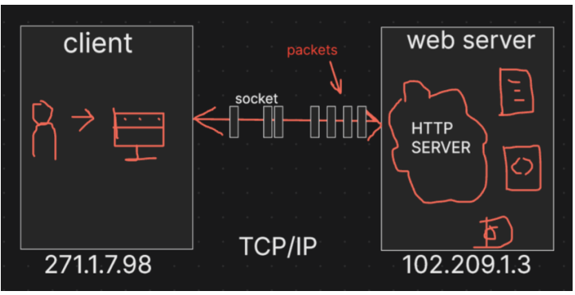

# Episode 11: Creating A server

### What is a Server?

- **Hardware Definition**: A physical machine (computer) that provides resources and services to other computers (clients) over a network.
- **Software Definition**: An application or program that processes requests and delivers client data.

## AWS and cloud computing

**AWS**: Provide cloud-based services and resources including servers 

**EC2 instance**: a virtual server rented on AWS, which takes care of hardware while you deploy your application on VM 

 

### TCP/IP  protocol

- protocol means a set of rules that define how computers communicate with each other.
- HTTP server means a language/set of rules that defines how clients and servers communicate
- Types of Protocols
    1. FTP (File transfer protocol): used for transferring files 
    2. SMTP (Simple Mail Transfer Protocol): used for sending emails 

## How Data is Sent in a Server Request?

1. Sent in Packets
    - **data is sent in chunks**, known as **packets.**
    - packets are smaller units of the entire data being transmitted
    - **TCP/IP protocol** manages the transmission of these packets.
2. Streams and Buffers in Node.JS
3. **Domain Name System (DNS)**:
    - responsible for translating domain names into IP addresses.

### Can I create multiple Servers?

Yes,

- a single server can run multiple nodejs application. each application is distinguished by port number it runs on

- HTTP servers are identified by its IP address and port number
- for example: IP : `102.209.1.3` and port number : `3000` it would be referred as `102.209.1.3: 3000`.
- The combination of IP address and port tells the network which specific server application should receive the request.
- 102.209.1.3:3000 could point to a React application.
- 102.209.1.3:3001 could point to a Node.js application.

### Adding path using URL

namastedev.com/api/getUserInfo

123.4.5.6 : 3000 code

`IP + PORT + PATH = URL` 

`IP + PORT`  ⇒ Domain Name

`Path` ⇒ API

- Requests to [namastedev.com](http://namastedev.com/) go to the React application on port 3000 .
Requests to [namastedev.com/node](http://namastedev.com/node) go to the Node.js application on port 3001 .

In large companies servers are distributed, 

1. Dedicated database server
    - The database is typically hosted on a separate, high-performance server that specializes in storing and managing data.
2. Media and file server
    - Large files like videos and images are stored on specialized servers optimized for data delivery and performance.
    - generally, CDN is used to distribute files efficiently
3. through inter-server communication
    - Servers often need to communicate with one another to fulfill client requests

## Sockets vs Web Sockets

### Sockets

- Single Response Cycle: when the user makes a request, a socket connection is established between the client and the server
    - client sends request → server processes → send back response → connection is close
- new connections is opened for each subsequent request

### Web Sockets

- allows the connections to remain  open after the initial request
- both server and client can send and receive data at any time without re-establishing the connection